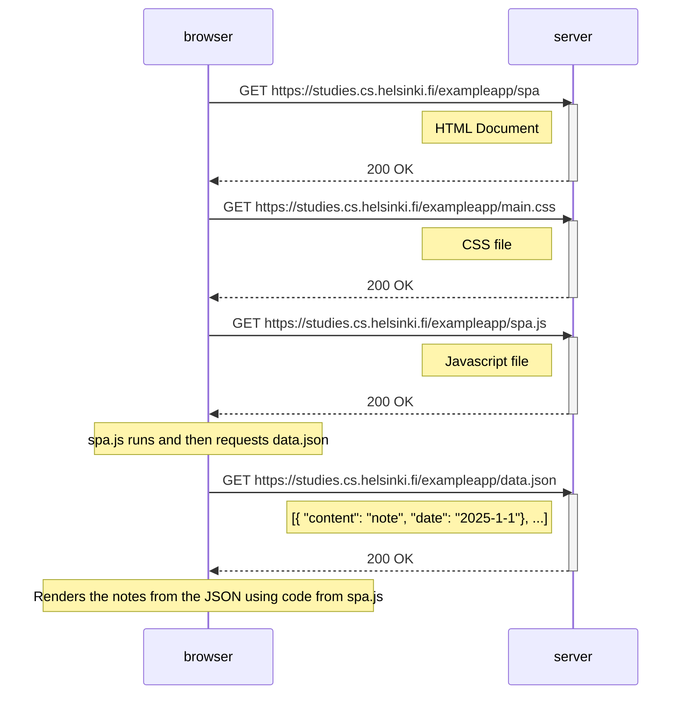

# Exercise 0.5: SPA diagram

```mermaid
sequenceDiagram
    participant browser
    participant server

    browser->>server: GET https://studies.cs.helsinki.fi/exampleapp/spa
    activate server
    Note left of server: HTML Document
    server-->>browser: 200 OK
    deactivate server

    browser->>server: GET https://studies.cs.helsinki.fi/exampleapp/main.css
    activate server
    Note left of server: CSS file
    server-->>browser: 200 OK
    deactivate server

    browser->>server: GET https://studies.cs.helsinki.fi/exampleapp/spa.js
    activate server
    Note left of server: Javascript file
    server-->>browser: 200 OK
    deactivate server

    Note over browser: spa.js runs and then requests data.json

    browser->>server: GET https://studies.cs.helsinki.fi/exampleapp/data.json
    activate server
    Note left of server: [{ "content": "note", "date": "2025-1-1"}, ...]
    server-->>browser: 200 OK
    deactivate server

    Note over browser: Renders the notes from the JSON using code from spa.js
```